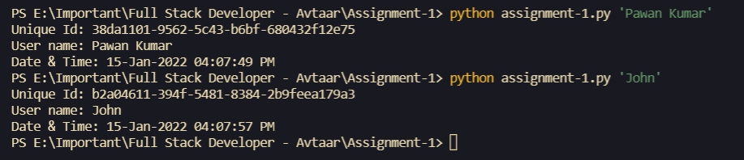

# Program to generate unique Id and submit a GitHub PR

To get the above objectives, I have created a python script, "assignment-1.py".

## Generate Unique Id
 I have used a python library 'uuid' to generate a unique Id. uuid library has many methods to create a unique id.
 I have used uuid4 and uuid5. 
 * First, this python script will generate a random UUID with uuid4.
 * Then I have used uuid5. It generates a UUID based on the SHA-1 hash of a namespace identifier (a UUID) and a name (a string). uuid5 will take the UUID generated by the uuid4 as a namespace identifier and time in milliseconds as a string(converting the milliseconds to string). 
 
 UUID generated by uuid5 will be unique in all circumstances as it takes a random UUID generated by uuid4 and time in milliseconds.

## To run the script
To get the result, run the following command in the directory of the "assignment-1.py" file.
```
python assignment-1.py <user name>
```
## Screenshot of the Output

 