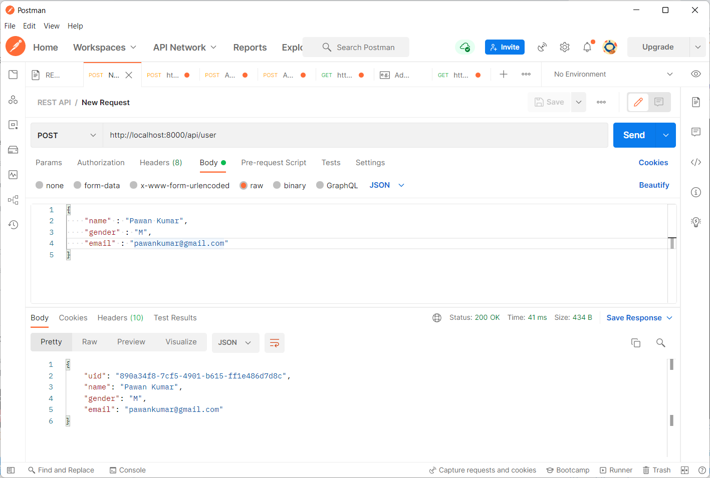
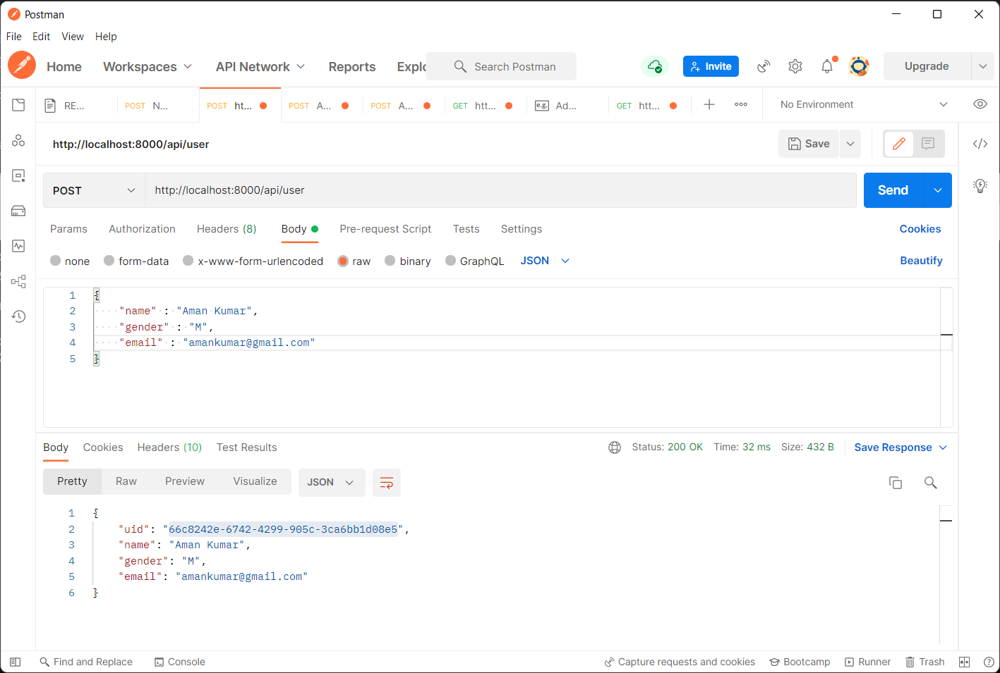
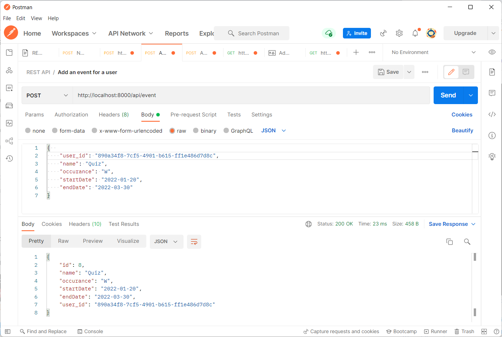
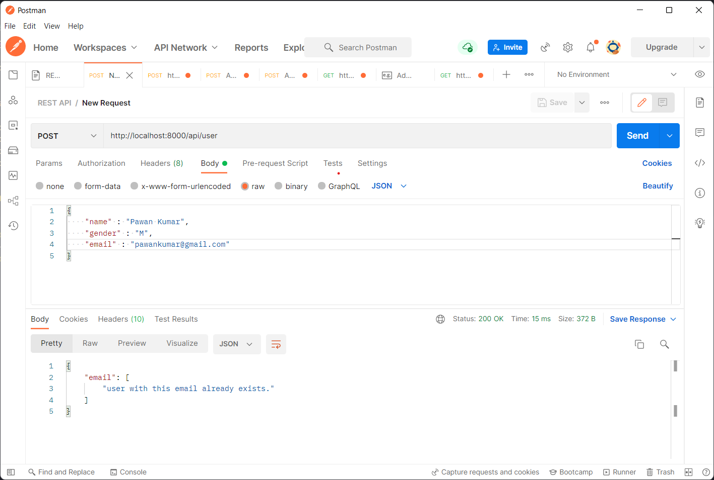
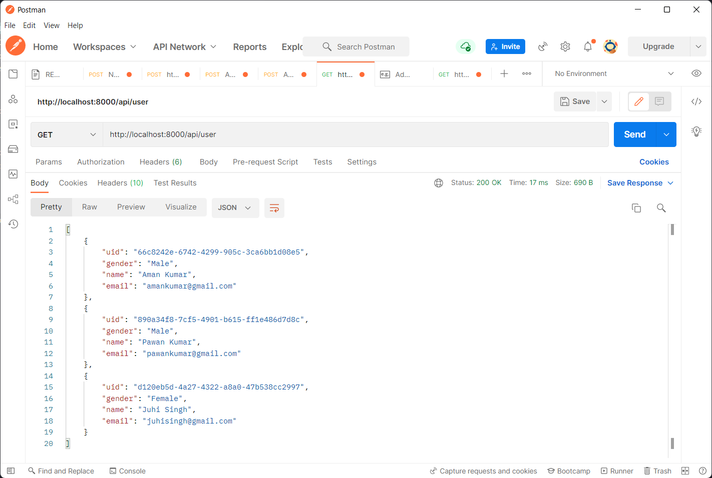
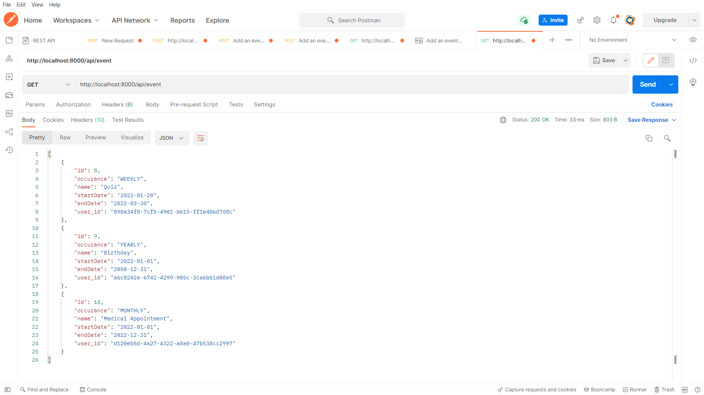
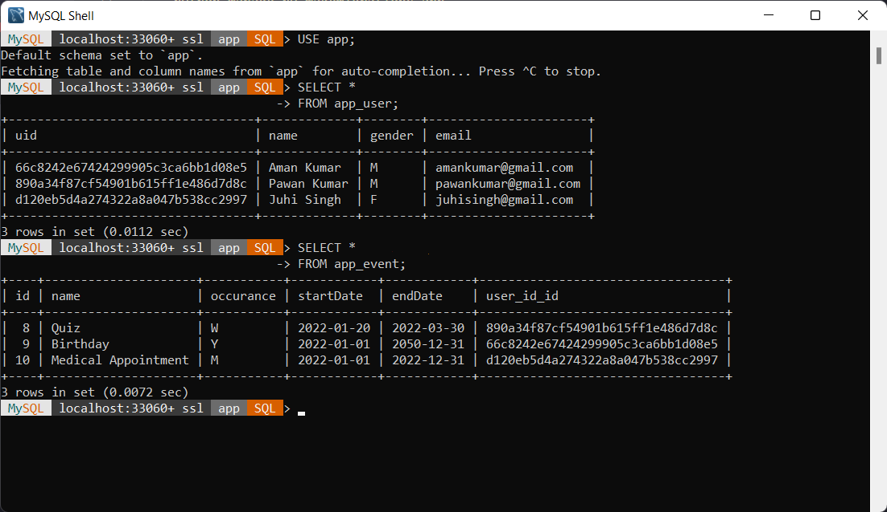

# Assignment 2 : DB and REST API for User-Events.

This section contains mysql database to create tables as below with the given columns

1.  User

    - uid(primary key, aut generated)
    - name- String, non-nul
    - gender - String(enum values Male/Female)
    - email - unique in the table, non-null

2.  Events
    - id (primary key , auto generated)
    - uid(uid of the User to who the event belongs) non-null
    - name - String, name of the event
    - occurance(enum values WEEKLY/ MONTHLY/YEARLY/ONETIME) non-null
    - startDATE - Date non-null
    - endDate - Date

    I created two classes User and Event inside models.py to achieve the above objective. 
    
    Create a schema in mysql with name "app".
   

And a REST API for the following

1.  Add User
2.  Add event for a user

- Documentation for the API can be found in REST API DOC.md or click [here](https://github.com/singhpawank/Full-Stack-Developer-Avtaar/blob/assignment-2/Assignment-2/REST%20API%20DOC.md)

## Requrements for this API

- Run the following command in the "Assignment-2/REST_API" directory
    ```
    pip install -r requirements.txt
    ```

- Now create a ".env" file inside "Assignment-2/REST_API" directory  
  This file must have SECRET_KEY and Database password
  for example:
    ```
    SECRET_KEY = 'dxgijrenoabnoldfbnolAENBVKUDudbrsuovnl'
    MYSQL_DB_PS = 'mysql'
    ```
- To create a secure random secret key
  Open a Django shell with python manage.py shell and do the following to create a secure random secret key
    ```
    >>> from django.core.management.utils import get_random_secret_key
    >>> get_random_secret_key()
    '[GENERATED KEY]'
    >>>
    ```
    The >>> represents the shell prompt, and should not be typed.
## To run the API
- Run the following command in the "Assignment-2/REST_API" directory
    ```
    python manage.py runserver
    ```

    To make tables to database run the following commands
    ```
    python manage.py makemigrations
    python manage.py migrate 
    python manage.py makemigrations app
    python manage.py migrate app
    ```
## Executuion of API in postman
### POST requests
1. POST request to add a user "Pawan Kumar"

    

2. POST request to add a user "Aman Kumar"

    

3. POST request to add an event for a user Aman Kumar

    

4. POST request to add an event for a user Pawan Kumar
    

5. POST request to add a user with existing email does not make duplicate

    
### GET requests
1. GET request to show users

    

2. GET requests to show events

    

## Database 
   * Tables for users and events in MYSQL database

     

---
    