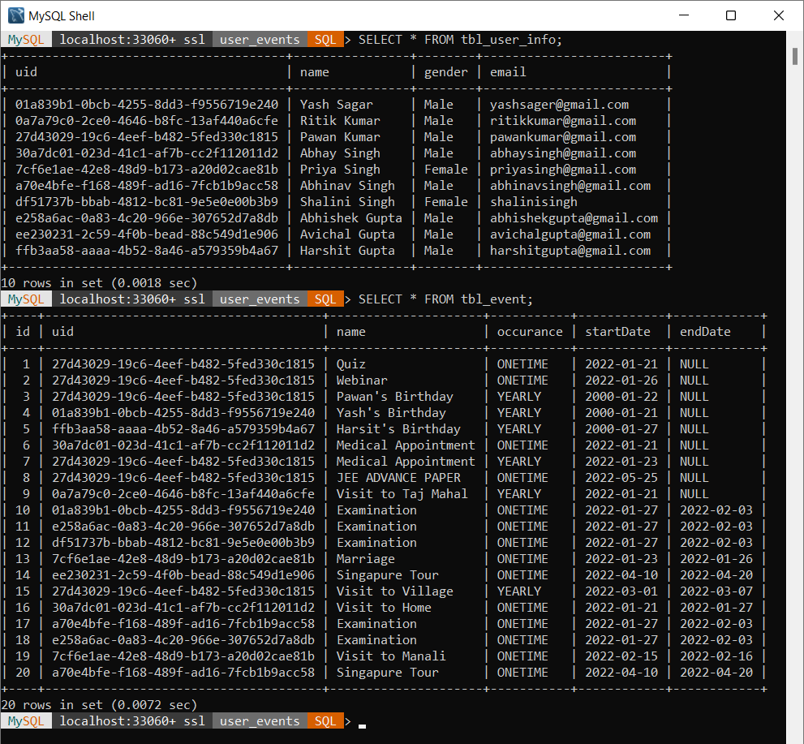
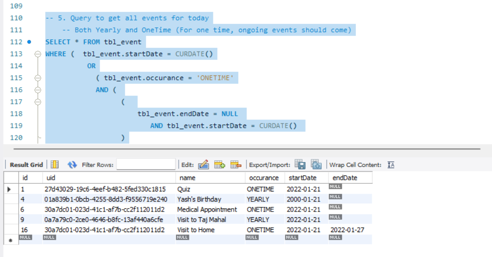
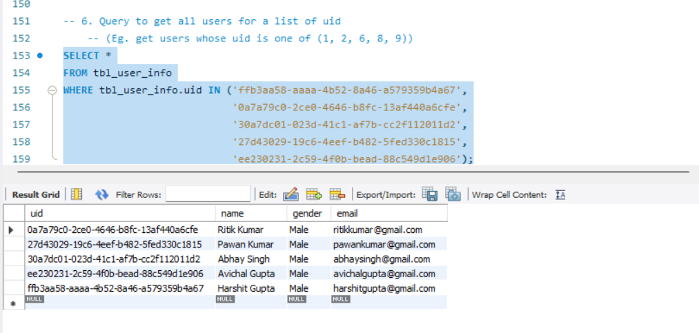
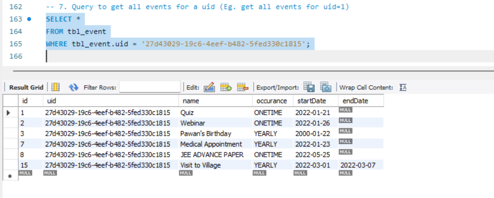
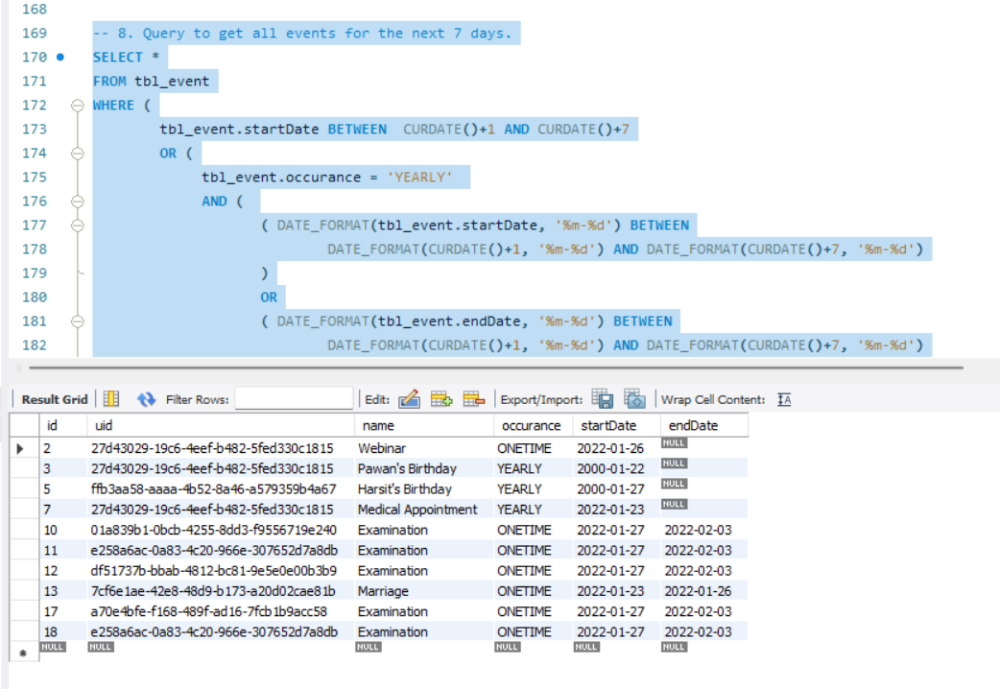

# Assignment - 3 : SQL DB queries for User-Events

This section contains mysql DB queries to create tables with the given columns:
1. User 
   - uid (primary key, auto generated) 
   - name - String, nun-null 
   - gender - String (enum values Male/ Female) 
   - email - unique in the table, non-null 

2. Events 
   - id (primary key, auto generated) 
   - uid (uid of the User to who the event belongs) non-null 
   - name - String, name of the event 
   - occurrence (enum values YEARLY/ ONETIME) non-null 
   - startDate - Date non-null 
   - endDate - Date

**SQL queries for above tables are in [Queries.md](Queries.md).** I also included a sql file [Queries.sql](Queries.sql) with all sql queries.

## Screenshots of Database and 'SELECT' queries

1. Database : Table 'tbl_user_info' for users and 'tbl_event' for events
   
   

2. Query to get all events for today

   

3. Query to get all users for a list of uid

   

4. Query to get all events for a uid

   

5. Query to get all events for the next 7 days

   

---
