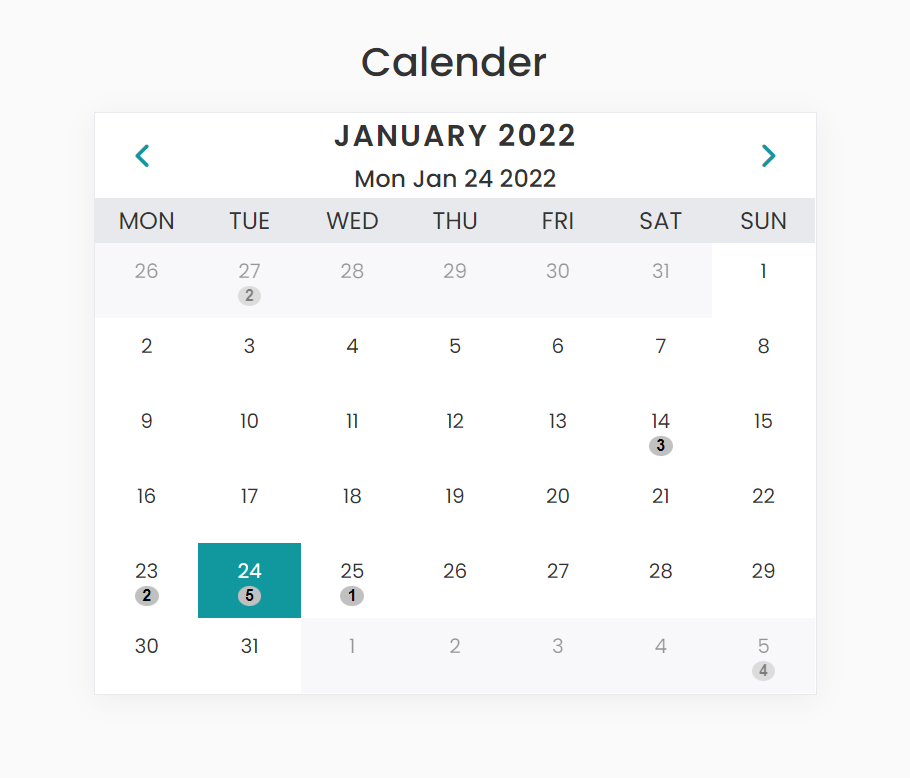
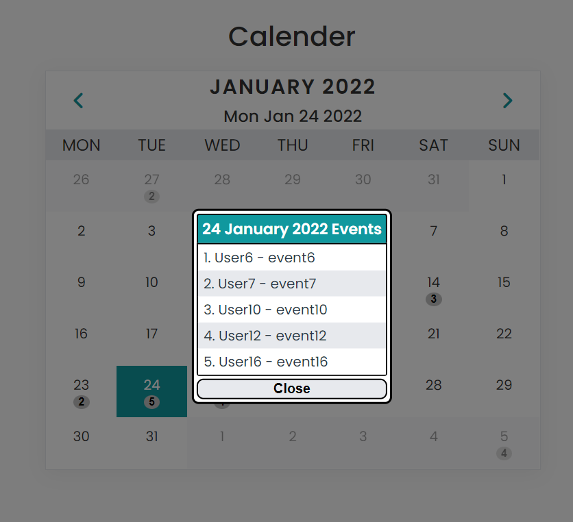

# UI - Displaying a Calender of Events

This is a simple UI for a calender to

- Display a date wise calender showing 1 month at a time. There might be multiple events of the same/different user on a given day, and
- Each date have the count of total events, on clicking the count, show a list of events as "{Username} - {Event name}".

This is made with html, CSS and Javascript.

## Steps to run the code

- Clone branch "assignment-4"
- Open "Calender/index.html" in browser

## Events

- All the events are kept in "events.js" file as a list of evetns(["username", "event name", "yyyy-mm-dd"]).
- To add, remove or update a event, edit the file "events.js".

## The UI - Calender

## Show list of Events

1. **Events for 24th Jan**

2. **Events for 5th Feb**

---
