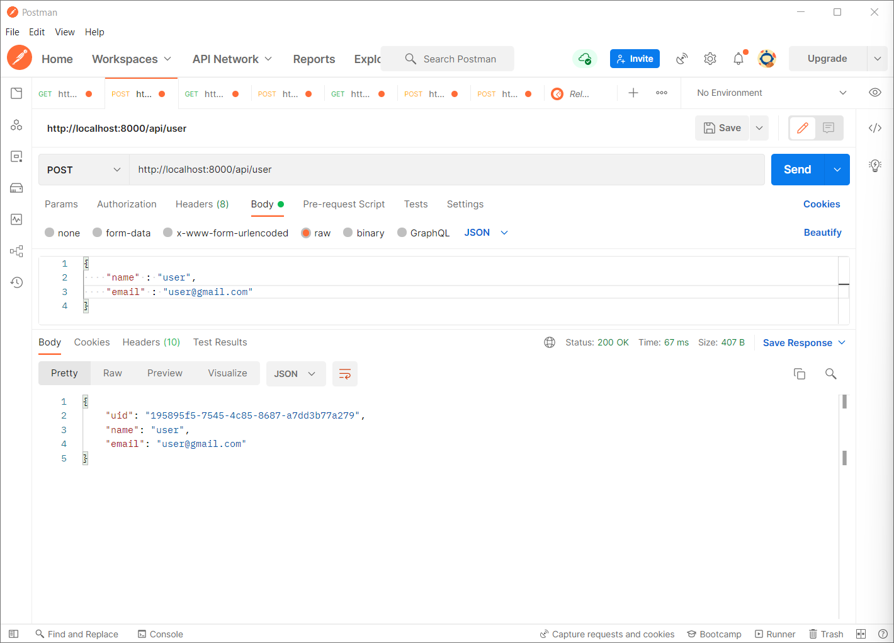
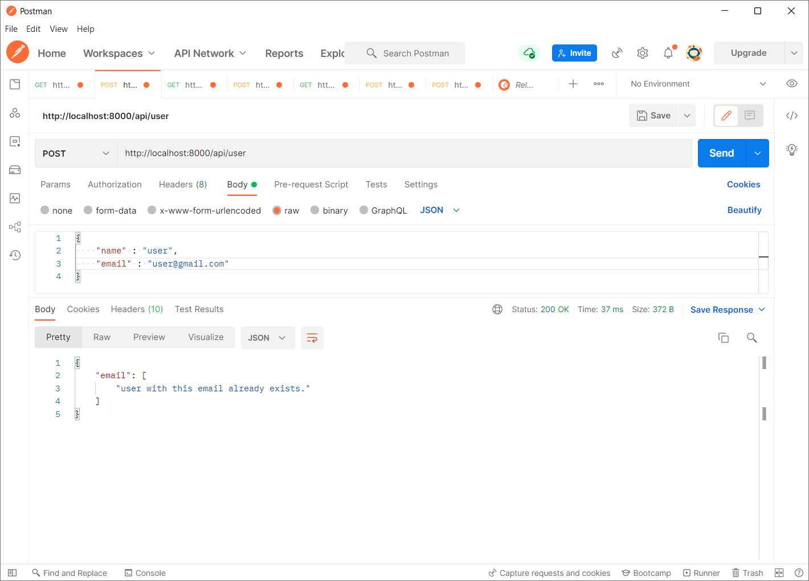
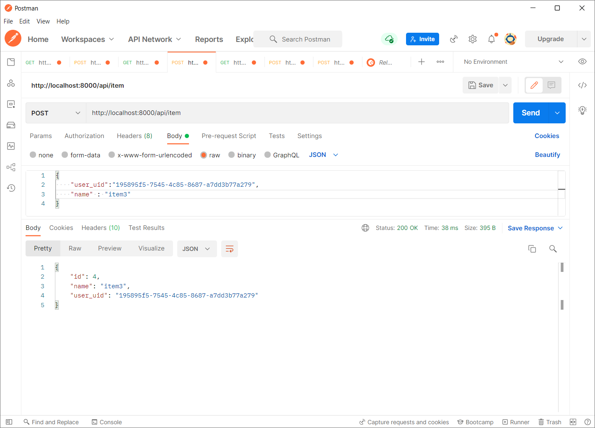
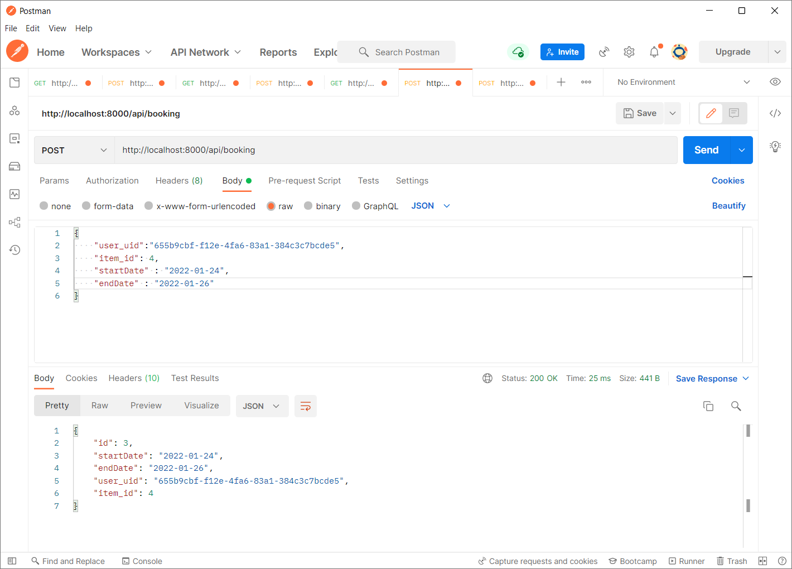
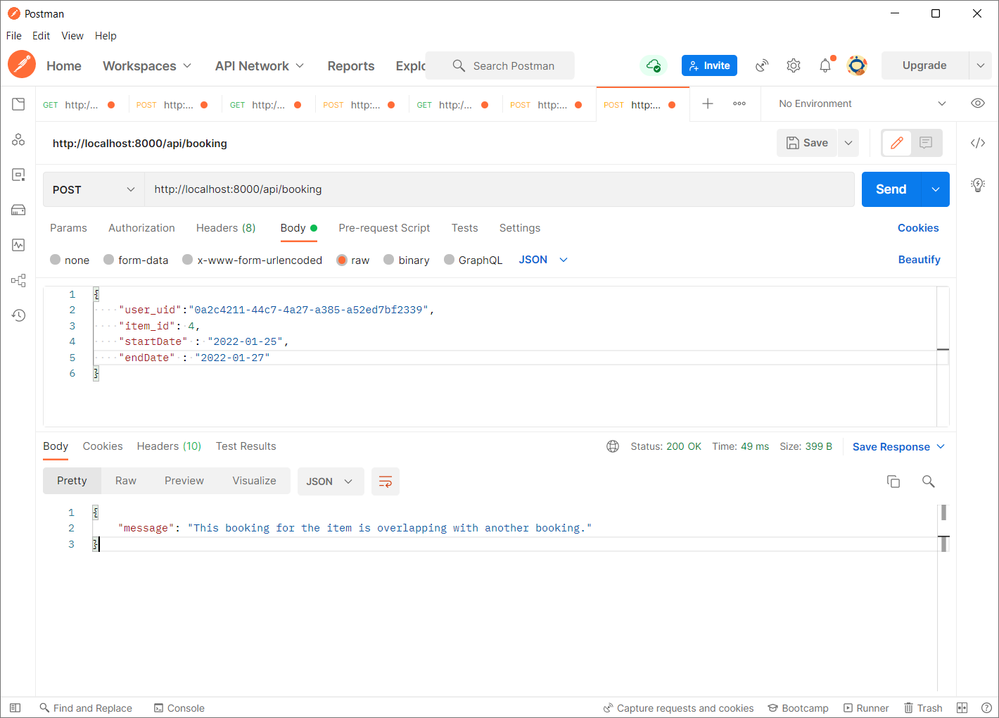
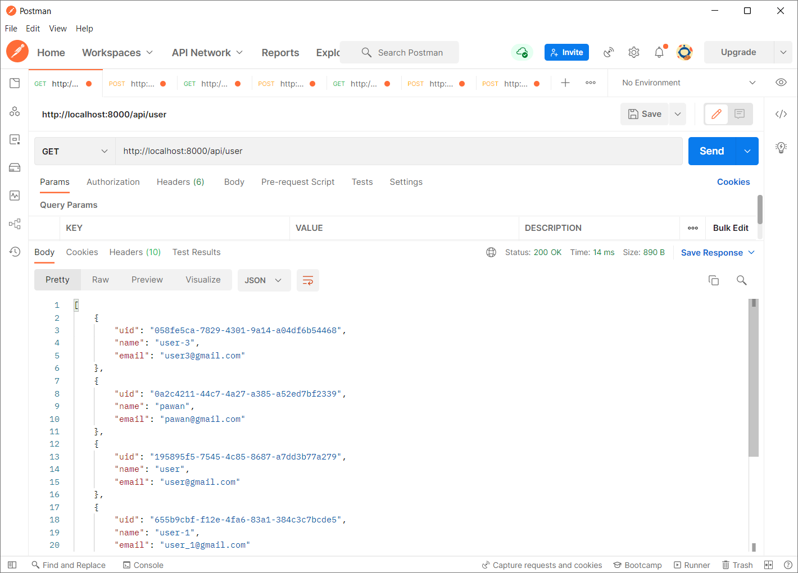
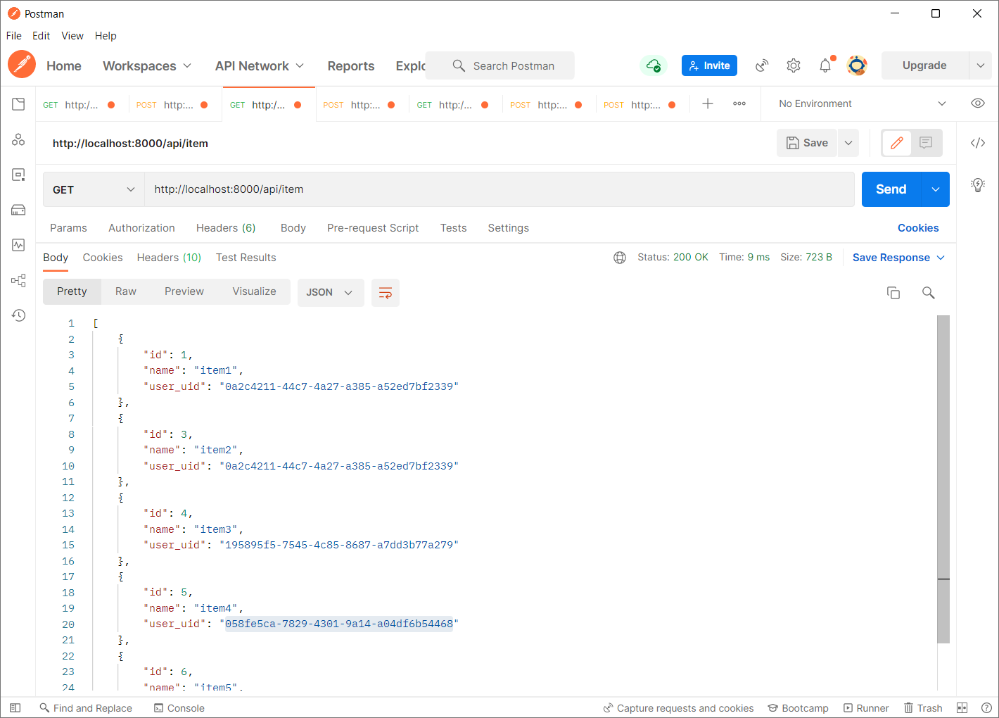
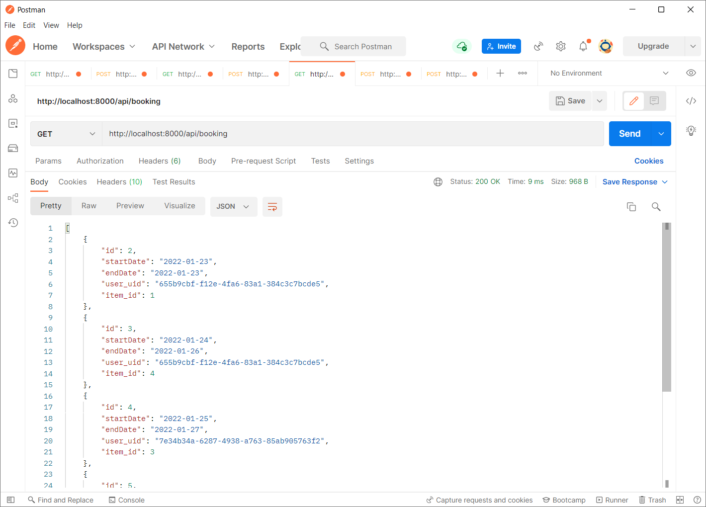
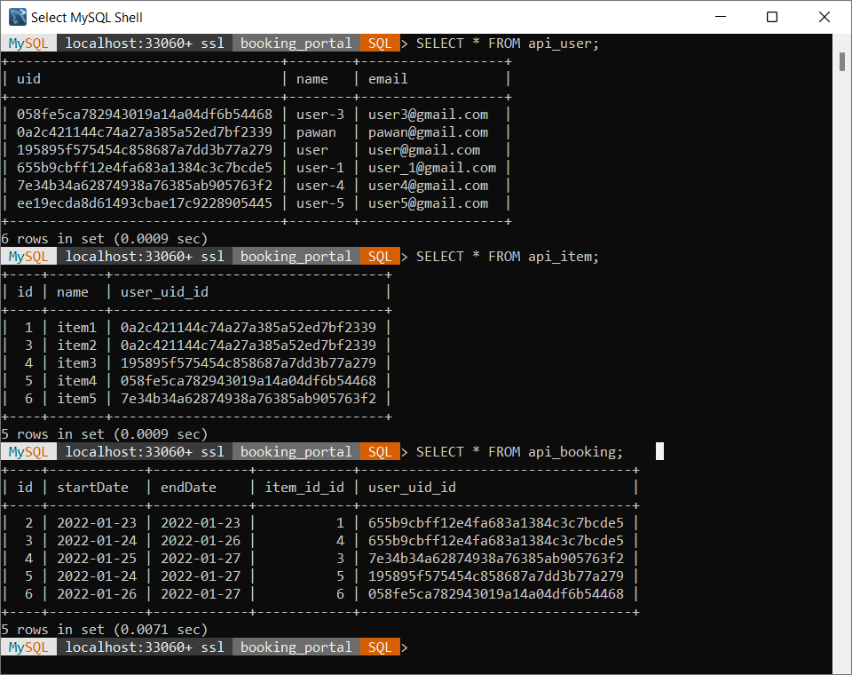

# Assignment 5 : DB and REST API for user-Item-Booking

This section contains a REST API for the following

1.  Add User - Returns error if the email is already taken
2.  Add item
3.  Add booking - Returns error if the dates overlap

- Documentation for the API can be found in REST API DOC.md or click [here](https://github.com/singhpawank/Full-Stack-Developer-Avtaar/blob/assignment-5/Assignment-5/REST%20API%20DOC.md)

And a database schema with tables as below with the given columns

1.  User(All non-null fields)

    - uid(primary key, aut generated)
    - name- String
    - email - unique in the table

2.  Items(All non-null fields)

    - id (primary key , auto generated)
    - uid(uid of the User who owns this item)
    - name - String, name of the item

3.  Booking(Composite primary key - uid and item's id), All non-null fields

    - uid(uid of the user who is booking)
    - id(item id that is being booked)
    - startDATE - Date(Booking start from)
    - endDate - Date(Last date of booking)

    I created two classes user, item and booking inside models.py to achieve the above objective.

    I used mysql database and a schema with name "booking_portal".

## Requrements for this API

- Run the following command in the "Assignment-5/REST_API" directory

  ```
  pip install -r requirements.txt
  ```

- Now create a ".env" file inside "Assignment-5/REST_API" directory  
  This file must have SECRET_KEY and Database password
  for example:
  ```
  SECRET_KEY = 'dxgijrenoabnoldfbnolAENBVKUDudbrsuovnl'
  database_password = 'mysql' // this password is for root user
  ```
- To create a secure random secret key
  Open a Django shell with python manage.py shell and do the following to create a secure random secret key
  ```
  >>> from django.core.management.utils import get_random_secret_key
  >>> get_random_secret_key()
  '[GENERATED KEY]'
  >>>
  ```
  The >>> represents the shell prompt, and should not be typed.

## To run the API

- Clone branch "assignment-5"

- Run the following command in the "Assignment-5/REST_API" directory

  ```
  python manage.py runserver
  ```

  To make tables to database run the following commands

  ```
  python manage.py makemigrations
  python manage.py migrate
  ```

## Executuion of API in postman

### POST requests

1. POST request to add a user

   

2. POST request to add a user with existing email  
   - Return error  
   
   

3. POST request to add an item  
   

4. POST request to add a booking  
   

5. POST request to add a booking with overlapping
   - Returns error  

   

### GET requests

1. GET request to show users   
   

2. GET requests to show items   
   

3. GET request to show bookings     
   

## Database

- Tables for users, item and booking in MYSQL database   
  

---
